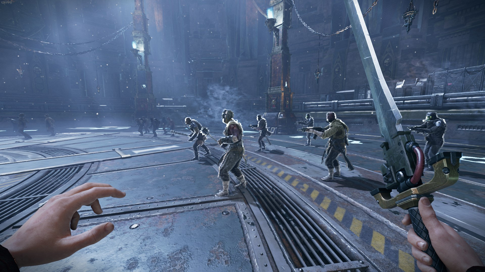
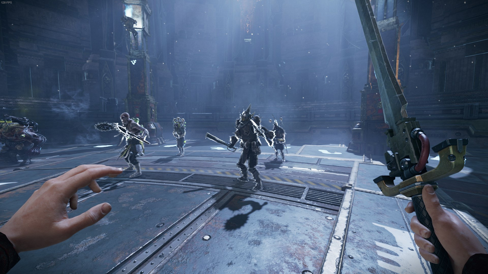

# Always Outline mod for Warhammer 40,000: Darktide
The mod applies outlines to all or chosen enemy groups automatically.

## Settings
Per default the mod uses the color [Grey](https://www.colorhexa.com/808080) (128, 128, 128) for all outlines. If you want to improve the visibility, you can simply change it to [White](https://www.colorhexa.com/ffffff) (255, 255, 255).  
Per default only Specialist, Elite and Monstrosity are enabled.  
 
## All Enemies
The "All Enemies" option will outline all possible enemy types.  
But it doesn't work for normal horde enemies like Poxwolker or Groaner, since the game has no outline data for their models. 

## Specialist
Outlines [specialists](https://darktide.gameslantern.com/enemies?type=SPECIALIST).

## Elite
Outlines [elite](https://darktide.gameslantern.com/enemies?type=ELITE) enemies and [captains](https://darktide.gameslantern.com/enemies?type=CAPTAIN).
  

## Monstrosity
Outlines [Monstrosities](https://darktide.gameslantern.com/enemies?type=MONSTROSITY).  
  

## In game
  