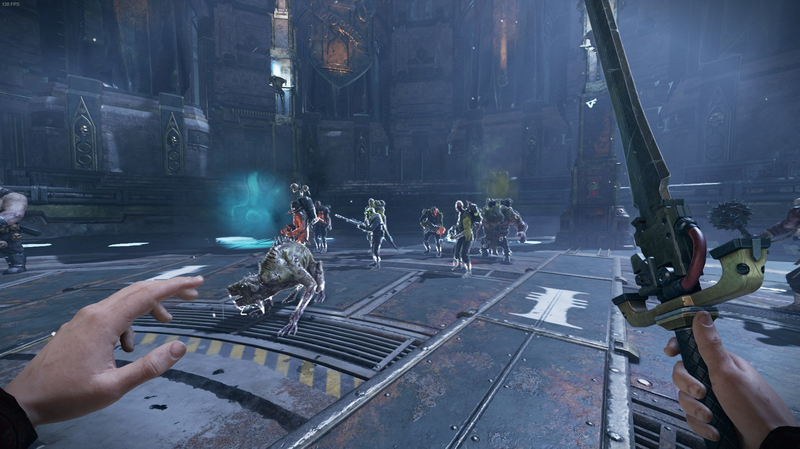

# Always Outline mod for Warhammer 40,000: Darktide
The mod applies outlines to all or chosen enemy groups automatically.

If you don't know how the game works, I recommend playing it without the mod first, otherwise you should know that the outlines are visible through the walls and basically act as a wallhack.

## Settings
Per default the mod uses the color [Grey](https://www.colorhexa.com/808080) (128, 128, 128) for all outlines. If you want to improve the visibility, you can simply change it to [White](https://www.colorhexa.com/ffffff) (255, 255, 255).  
Per default only Specialist, Elite and Monstrosity are enabled.  

## Installation via Vortex
I assume that you know how [Vortex Mod Manager](https://www.nexusmods.com/about/vortex) works and that you have set it up together with the [Darktide Vortex Extension](https://www.nexusmods.com/site/mods/684).

Make sure that you've installed the [Darktide Mod Loader](https://www.nexusmods.com/warhammer40kdarktide/mods/19) and the [Darktide Mod Framework](https://www.nexusmods.com/warhammer40kdarktide/mods/8) first. 

1. Navigate into the **Mods** tab.
2. If the "Drop file" panel is hidden, open it with the arrow down button at the bottom right corner.
3. Drag and drop mod's zip file into the "Drop File(s)" field.
4. The mod should be installed now, verity that it's enabled in the **Load Order** tab.

## Manual Installation
I assume that you know how [Vortex Mod Manager](https://www.nexusmods.com/about/vortex) works and that you have set it up together with the [Darktide Vortex Extension](https://www.nexusmods.com/site/mods/684).

1. Navigate into games root directory->mods.  
Steam example: *C:\Program Files (x86)\Steam\steamapps\common\Warhammer 40,000 DARKTIDE\mods\\*
2. Download and open AlwaysOutline zip file.
3. Extract the **AlwaysOutline** folder from the zip file into the game's **mods** directory.
4. Open the **mod_load_order.tx**t file in the game's **mods** directory with any Text Editor like Notepad.
5. Add a new line at the bottom of the text file with mod's name aka. **AlwaysOutline**.
 
## All Enemies
The "All Enemies" option will outline all possible enemy types.  
But it doesn't work for normal horde enemies like Poxwolker or Groaner, since the game has no outline data for their models. 

## Specialist
Outlines [specialists](https://darktide.gameslantern.com/enemies?type=SPECIALIST).

## Elite
Outlines [elite](https://darktide.gameslantern.com/enemies?type=ELITE) enemies and [captains](https://darktide.gameslantern.com/enemies?type=CAPTAIN).
  

## Monstrosity
Outlines [Monstrosities](https://darktide.gameslantern.com/enemies?type=MONSTROSITY).  
  

## In game
  